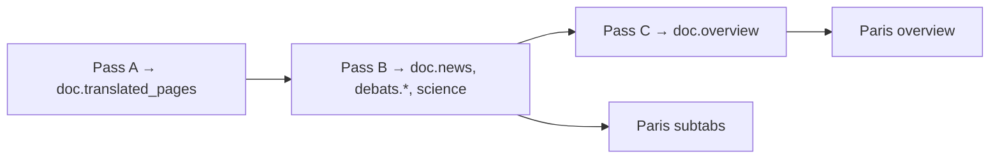

# Day Page v2 — remaining work

Shell (four tabs, PaperTab, sidebar, people cards, `doc.news` schema) is shipped. Do these in order.

## 1. Pass C input

- [ ] **tune-summarize-prompt** — add "scandals" to Rule 5 in [lib/llm/summarize.ts](lib/llm/summarize.ts) (prompt otherwise unchanged)
- [ ] **summarize-from-sections** — add `summarizeSectionTexts()` beside `summarizeTranslatedPages()`; [lib/summarize/pipeline.ts](lib/summarize/pipeline.ts) loads R2 text from `ALL_SECTIONS` (`news`, `debats.*`, `art_exhibitions`, `science`), falls back to `translated_pages`. Labeled blocks:

```
--- News & Politics ---
{doc.news text}

--- Music ---
{doc.debats.music text or "(empty)"}
...
```

## 2. Chain Pass C after translate

Pass C runs **after** Pass B persists sections (sequential, not parallel).

- [ ] **chain-summarize** — in [translate-day.ts](scripts/translate/translate-day.ts), after `runDayTranslation`:

```ts
let summarize: SummarizeRunSummary | undefined;
try {
  summarize = await runDaySummarization(date, log, { model });
} catch (err) {
  log(`[translate-day] Summarize failed (translation still succeeded): ${err}`);
}
```

Extend `TranslationRunSummary` / `translation_runs.summary` with summarize outcome. Mirror in [ingest-day.ts](scripts/ingest-day.ts) and [translate-all.ts](scripts/translate/translate-all.ts).

Existing dates: no automated backfill — run `summarize-day --date=…` manually per day.

## 3. Admin translate controls

- [ ] **translate-two-buttons** — `force?: boolean` on [requestDayTranslation](app/actions/admin.ts); append `--force` to CLI spawn when true. Two buttons in [DayPageView.tsx](components/day/DayPageView.tsx):

| Button       | Pass A        | Pass B        | Pass C        |
| ------------ | ------------- | ------------- | ------------- |
| Translate    | skip existing | may use cache | always re-run |
| Re-translate | redo all      | re-segment    | always re-run |

## 4. Paris tab UI (reader + admin)

- [ ] **paris-subtabs-ui** — rewrite [ParisThatDayTab.tsx](components/day/ParisThatDayTab.tsx):

**Reader:** `doc.overview` default; subtabs Arts (`debats.art` + `art_exhibitions`), Literature, Science, Music, Theatre, News — hide empty; `renderItems()` per subtab.

**Admin — same layout:**

- [DayPageView.tsx](components/day/DayPageView.tsx): route `paris` + legacy `overview` / `debats` / `art` / `science` → `ParisThatDayTab` (stop using OverviewTab, DebatsTab, ArtTab, ScienceTab)
- [TabRow.tsx](components/day/TabRow.tsx): drop granular admin tabs; use `paris`
- Always show all subtabs; empty → [AdminItemList](components/admin/AdminItemList.tsx) (reuse empty copy from old tabs)
- Optional: `?tab=paris&paris=literature` for deep links

## 5. Polish (optional)

- [ ] **tabrow-admin-mobile-grid** — [TabRow.tsx](components/day/TabRow.tsx) count-driven borders
- [ ] **paper-feuilleton-in-scan** — feuilleton on page-1 scan inside PaperTab

---

## Pipeline reference



| Paris UI               | `doc` field                        | Pass | Already in pipeline?             |
| ---------------------- | ---------------------------------- | ---- | -------------------------------- |
| Overview               | `doc.overview`                     | C    | No — chain needed                |
| Arts                   | `debats.art` + `art_exhibitions`   | B    | Yes                              |
| Literature             | `debats.literature`                | B    | Yes                              |
| Science                | `science`                          | B    | Yes                              |
| Music / Theatre / News | `debats.music`, `.theater`, `news` | B    | Yes (`overview` anchor → `news`) |
| The paper              | `translated_pages`                 | A    | Yes                              |

**Section labels:** Pass B anchor segmentation in [lib/llm/translate.ts](lib/llm/translate.ts) tags spans as `debats.art`, `debats.literature`, `science`, etc., slices English, writes to `doc.*` + R2. Anchors cached per page at `{date}/en-segment-anchors/page-{n}.json`. `translated_pages` is verbatim prose (no semantic labels on spans); Paris subtabs read the Pass B `doc.*` fields directly. No new schema keys needed.

**Empty subtabs after first translate:** issue may lack that column, or anchors missed on noisy OCR — re-run with `--force` or `backfill-sections`; not a schema gap.

**Not in scope:** bulk backfill, new `doc` keys, teaser-only cards, Gutenberg/Galignani/scans work.
