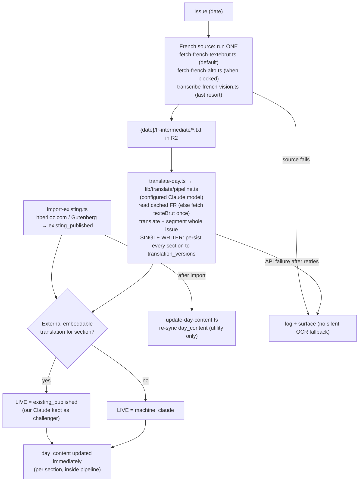
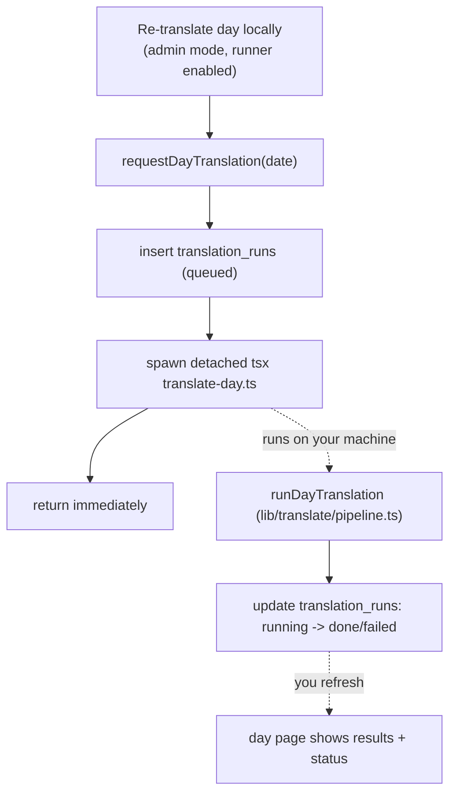

# Translation Architecture

How the _Count of Monte Cristo Experience_ sources, transcribes, translates, scores, stores, and cites the text of the 1844-46 _Journal des Débats_ and the novel's feuilleton. This is the living source of truth for the translation pipeline; update it whenever a source, model, or rule changes.

Implementation lives in Sprint 6 (`.cursor/plans/mc_sprint_6_cms_pipelines_launch_ec1ffef2.plan.md`): `lib/gallica.ts`, `lib/llm/translate.ts`, `scripts/translate/*`, the `translation_versions` table, and the inline-admin compare UI.

---

## Principles

- **Originals first.** The public sees the scanned paper (cropped feuilleton strip + full 4-page facsimiles) plus a Gallica link. English is the reading text; we never display French transcriptions to readers.
- **Translate everything, keep everything.** Segmenting an issue into music/theatre/art/novel requires reading the whole paper, so we translate the full content of every issue regardless of whether an external translation exists, and persist every translation we pay tokens for. External translations sit beside ours for comparison, they do not gate our work.
- **Cite the works of others, not our engine.** Public citations credit the original author/work and any human translator, and link to the French original. We never advertise "translated by {model}" to readers; the model is recorded for admin/bookkeeping only.
- **No silent fallback.** No DeepL. No Tesseract. If a source is missing or a model call fails after retries, we log a structured error and surface it in admin; we never quietly substitute.
- **Admin-reviewable, never gated.** The chosen translation ships immediately. Quality concerns are tracked with admin-only flags and a full version history, not a public draft state.

---

## French source text hierarchy

The French we translate from, in order of preference per section. Higher tiers are cleaner; we record which tier was used.

| Tier | Source                                                                         | Scope                                    | Why / quality                                                                                                                                                      |
| ---- | ------------------------------------------------------------------------------ | ---------------------------------------- | ------------------------------------------------------------------------------------------------------------------------------------------------------------------ |
| 1    | **FMC Project** (Francophone Music Criticism Project, SAS-Space)               | Music feuilletons (Berlioz et al.)       | Hand-corrected scholarly transcription; gold standard for music                                                                                                    |
| 2    | **Europeana Newspapers OLR** (BnF dataset, JSON `contentAsText`)               | Whole issues, if Débats 1844-46 included | OCR + optical layout recognition: article-segmented, hyphenation stripped, cleaner than raw `texteBrut`                                                            |
| 3    | **Gallica `texteBrut`** (`{ark}.texteBrut`)                                    | Whole issues, always available           | Free baseline OCR; flat dump, no section structure; self-reported accuracy ranges ~63-85%. Default source (`fetch-french-textebrut.ts`)                            |
| 3    | **Gallica ALTO** (`{ark}/f{n}.alto`, per-page XML stitched in reading order)   | Whole issues, always available           | Same BnF OCR as `texteBrut` via a different endpoint; the working fallback when `texteBrut` is Cloudflare-blocked (`fetch-french-alto.ts`)                         |
| 4    | **Claude vision transcription** of the R2 page scans (experimental; see below) | Last resort when both Tier 3 paths fail  | Modern multimodal OCR; better on damaged type, but hallucination + content-filter risk, so a manual escape hatch (`transcribe-french-vision.ts`), not the baseline |
| -    | **Project Gutenberg FR / Wikisource**                                          | The novel's chapter feuilleton only      | Clean public-domain French of the novel; never vision-OCR'd                                                                                                        |

Tesseract is intentionally absent. Gallica and Europeana already provide BnF-run OCR, so we never OCR facsimiles with a legacy engine.

There is **no silent fallback chain** at runtime: each French source is its own script that writes one file under `{date}/fr-intermediate/` and throws on failure. You choose the tier by which script you run. `translate-day.ts` then reads whatever intermediate is already in R2 (precedence: texteBrut → ALTO → vision), and fetches `texteBrut` once itself only when none exists.

---

## English text: live-text selection

We always produce our own Claude translation of every section. Separately, where an external English translation exists, we import it. The pipeline writes the live text to `day_content` immediately as each section completes. `update-day-content.ts` is a utility for re-syncing `day_content` after external translations are imported, applying this precedence:

| Origin (`translation_origin`) | Source                                                           | When it is the live text                                       |
| ----------------------------- | ---------------------------------------------------------------- | -------------------------------------------------------------- |
| `existing_published`          | hberlioz.com (Michel Austin / Monir Tayeb) — Berlioz feuilletons | Live for Berlioz sections where licensing permits embedding    |
| `existing_published`          | Project Gutenberg #1184 (anon. 1846 Chapman & Hall) — the novel  | Live for the chapter feuilleton                                |
| `machine_claude`              | Our Claude translation                                           | Live for every section with no embeddable external translation |

Our `machine_claude` translation is **always retained** in `translation_versions` even when an external translation is chosen live, so the admin can compare and promote ours if it reads better. Copyrighted anthologies (e.g. Roger Nichols, _Berlioz the Critic_, 2025) are **link-out only** via `translation_source_url`, never embedded.

---

## Translation engine

The model is **fully configurable via env vars; nothing is hardcoded.** Swapping engines is a one-variable change with no code edit.

| Role                                   | Model (env)                                          | Notes                                                                                                              |
| -------------------------------------- | ---------------------------------------------------- | ------------------------------------------------------------------------------------------------------------------ |
| Translation (current default)          | `claude-sonnet-4-5` (`TRANSLATION_MODEL`)            | Strong quality at lower cost for bulk day runs ($3/$15); override with `--model` or env for Opus/Fable experiments |
| Translation (higher quality)           | `claude-opus-4-8` (`--model` or `TRANSLATION_MODEL`) | Heavier voice work or difficult sections; ~$5/$25                                                                  |
| Translation (preferred when available) | `claude-fable-5` (`TRANSLATION_MODEL`)               | Tops EQ-Bench Creative Writing; flip the env var when it is unblocked, no code change                              |
| Translation (any)                      | any Anthropic model id (`TRANSLATION_MODEL`)         | Same client path; `model_used` recorded per version for comparison                                                 |
| Vision transcription (experimental)    | `TRANSLATION_VISION_MODEL` (→ `TRANSLATION_MODEL`)   | Cropped section images; parse-then-translate, never one-shot image to English                                      |

Every translation is stamped with `model_used` and retained in `translation_versions`, so work done under one engine stays labeled and a section can be re-translated under a different/newer engine later for side-by-side comparison.

Client: `lib/llm/translate.ts`, mirrored from stock-tracker (`dashboard/lib/llm/content.ts`, `stock_tracker/pipelines/market_intelligence/llm_client.py`): lazy singleton, `cache_control: ephemeral` on the system prompt, streaming, retry-with-backoff on `RateLimitError` / `InternalServerError` / `APIConnectionError` / `APIConnectionTimeoutError` (max 4 attempts, exponential backoff + jitter). Returns `TranslationUsage` with `cost_usd`.

System prompt is tuned for 1844-46 Débats voice: preserve register (Berlioz witty/biting, Janin ornate, art reviews reverent), keep period terminology, gloss obscure references in `[brackets]`, resolve proper nouns on first mention, do not modernize idioms, output Markdown, no added commentary.

### Env vars

```
ANTHROPIC_API_KEY=
TRANSLATION_PROVIDER=anthropic
TRANSLATION_MODEL=claude-sonnet-4-5
# Optional; vision OCR model. Falls back to TRANSLATION_MODEL when unset.
TRANSLATION_VISION_MODEL=claude-sonnet-4-5
```

---

## Pipeline flow



### Single-writer rule

Only **one code path** writes a given `translation_origin` to `translation_versions`:

- `scripts/translate/translate-day.ts` / `lib/translate/pipeline.ts` → `machine_claude` rows
- `scripts/translate/import-existing.ts` → `existing_published` rows
- `update-day-content.ts` → **only selects + snapshots**; never authors new version rows; run this after `import-existing.ts` to re-sync `day_content`
- `translateDay()` server action → calls `lib/translate/pipeline.ts` (same path as scripts)

All run lifecycle (queued → running → done/failed) is tracked separately in `translation_runs`, not `translation_versions`.

---

## Confidence derivation (`low_confidence` flag)

`low_confidence` is admin-only and surfaces an `<AdminNote>` ⚑. It is set when any of:

- **Source tier is weak:** Gallica `texteBrut` used and its self-reported OCR rate is below threshold (capture the rate Gallica returns per issue).
- **Source disagreement:** when both Gallica OCR and a Fable vision transcription exist, low token-level agreement between them flags the section.
- **Model self-report:** the translation prompt asks the model to flag passages it could not read or was unsure of; any flag sets `low_confidence` and appends detail to `admin_notes`.
- **Illegible markers:** transcription contains `[…]` / `[illegible]` spans above a threshold.

Highest confidence (never flagged by default): `existing_published` human translations and FMC-sourced French. Lowest: Tier 3/4 OCR on damaged pages.

---

## Persistence

### `TextItem` (live, in `day_content.doc`, jsonb)

Public fields: `text_r2_key`, `source`, `original_date`, `gallica_url`, `license`, `attribution`, `translation_origin`, `translator`, `translation_source_url`, `source_text_url` (link to the French original).

Admin-only fields: `translation_model`, `fr_intermediate_r2_key`, `admin_notes`, `low_confidence`, `translation_version_id`.

### `translation_versions` (sidecar table, admin-only RLS)

Every translation we ever produce (live or challenger) is a row, keyed by `(installment_date, section, slot_key, translated_at desc)`. Stores the EN R2 key, full provenance, `translation_origin`, `model_used`, `translator`, `translation_source_url`, `source_text_url`, `fr_intermediate_r2_key`, `cost_usd`, `low_confidence`, `admin_notes`, `translated_at`, `translated_by`. The live `TextItem` points at the current row via `translation_version_id`.

`slot_key` is the stable item identity (e.g. `chapter-1`, `debats.music-1`). It is assigned on first segmentation and reused on re-runs so history rows stay aligned across re-segmentation, not positional index drift.

### R2 keys

```
{date}/en/{slot_key}/{run_timestamp}.txt   English translation — immutable per version.
                                           Each run writes a new key; the live TextItem and each
                                           translation_versions row point at their own, so re-runs
                                           never overwrite prior versions (history compare relies on this).
{date}/fr-intermediate/gallica-textebrut.txt  French source — Gallica texteBrut (default; Tier 3)
{date}/fr-intermediate/gallica-alto.txt       French source — Gallica ALTO per-page stitch (Tier 3)
{date}/fr-intermediate/vision-issue.txt       French source — Claude vision OCR of page scans (Tier 4)
{date}/fr-intermediate/vision-page{n}.txt     Per-page vision transcript (cache for resume)
gallica/{date}/page-{n}.jpg                   Full-page facsimiles
```

---

## Admin review + compare

- **"Re-translate day locally"** button on day pages enqueues a run and dispatches it to the local CLI runner (see "Running translations locally" below): re-translates `machine_claude` items in place; for `existing_published` / public-domain items (incl. the Gutenberg chapter) generates a non-live Claude **challenger** instead of overwriting.
- **`<TranslationHistory>`** (per item, admin-only): lists versions by `translated_at desc` (live badged vs challengers), side-by-side diff of live EN vs version EN with the French source in a third panel, promote-to-current (reversible), delete.
- **Chapter "Compare translations"**: Project Gutenberg public-domain EN vs our Claude EN vs the French original, to judge whether ours is better and promote if so.
- **Translated paper (per-page)**: the full-page translations on the Translated paper tab use the same version history as section tabs, keyed by `slot_key = paper-page-N` under `section = translated_pages`. Each run snapshots the prior page text and writes a new version, so re-running under a different model (e.g. Opus then Sonnet) lets you compare page by page. The French panel shows only that page, sliced from the stitched intermediate.

---

## Cost ledger (informational; cost is not a constraint)

Spend depends on the configured `TRANSLATION_MODEL`. Sonnet 4.5 (default) is $3/$15 per M tokens; Opus 4.8 is $5/$25; Fable 5 is $10/$50.

| Pass                               | Volume                                             | Opus 4.8   | Fable 5    |
| ---------------------------------- | -------------------------------------------------- | ---------- | ---------- |
| Full-paper translation, first pass | ~1-1.5M words                                      | ~$60-100   | ~$120-200  |
| Optional vision transcription      | ~556 page-images (only low-confidence in practice) | ~$30-40    | ~$50-70    |
| Re-translation experiments         | per-day, ad hoc                                    | immaterial | immaterial |

`cost_usd` is recorded per `translation_versions` row (with the actual `model_used`), so real spend is auditable in admin.

---

## Vision-OCR: deferred — not planned for the near term

The on-demand vision transcription infrastructure is built (Sprint 9): the "Transcribe with vision" button in admin mode, the `visionTranscribe(date, page)` server action, and the R2 storage path for the FR intermediate. It is ready to use when needed.

**Vision OCR is not planned for the near term.** The Gallica `texteBrut` OCR baseline (Tier 3) is sufficient for translation work right now. This section stays here as a reference for when the need arises.

When the experiment is eventually run, the decision criteria are:

| Dimension           | Run it on                                | Pass condition                                                                    |
| ------------------- | ---------------------------------------- | --------------------------------------------------------------------------------- |
| Clean page          | A good-quality 1844 page with no damage  | Vision transcript token-level agreement with `texteBrut` ≥ 90%; no invented text  |
| Damaged page        | A page with visible foxing or faded type | Vision transcript meaningfully more readable than `texteBrut` (manual comparison) |
| Dense multi-column  | A page with 4-column layout              | Columns separated correctly; no cross-column bleed                                |
| Hallucination check | Any page                                 | No proper nouns or dates invented that are absent from `texteBrut`                |

Update this section with actual results when the experiment is run.

---

## Running translations locally

Translating a whole issue is a multi-minute Claude run, too long for a serverless request. So the work runs on **your own machine**, either from a terminal or triggered from the admin UI, never on the deployed server.

There is **one code path** for both triggers: `scripts/translate/translate-day.ts`. It owns the run lifecycle and delegates the per-section work to `lib/translate/pipeline.ts` (read the cached French intermediate, else fetch Gallica texteBrut once -> `lib/llm/translate.ts` -> single-writer `translation_versions` -> `day_content` persisted immediately per section).

### Two-terminal local workflow

```bash
# Terminal 1 — the app (for reviewing results)
npm run dev

# Terminal 2 — full ingest for one day (resolve → … → translate)
npx tsx scripts/ingest-day.ts --date=1844-08-28 --skip-existing

# …or just (re)translate a day whose French is already in R2
npx tsx scripts/translate/translate-day.ts --date=1844-08-28
```

### UI trigger (enqueue then refresh)

In admin mode the day page shows a **"Re-translate day locally"** button (only when the local runner is enabled, i.e. dev or `LOCAL_TRANSLATION_RUNNER=1`). It calls the `requestDayTranslation(date)` server action, which:

1. Inserts a `translation_runs` row with status `queued` and returns immediately (fire-and-forget; no spinner held).
2. Spawns `scripts/translate/translate-day.ts --date --run-id` **detached**, inheriting env, so the run survives dev hot reloads and executes on your machine.
3. The script transitions the run `running -> done`/`failed`, recording the summary or error.

You then **refresh the page** to see the new translations and the last-run status line. There is no polling; the status is read server-side on load.



`translateDay` therefore adopts an **enqueue** model rather than a synchronous return: the button accepts the request and the local runner produces the result, observed on refresh.

### `translation_runs` (run status, admin-only RLS)

Distinct from `translation_versions` (translated content history), this table records run/job status: `installment_date`, `status` (`queued|running|done|failed`), `summary` jsonb, `error`, `requested_by`, and `created_at`/`started_at`/`finished_at`. The day page reads the latest row per date to show the status line. Public never queries it.

---

## Provenance + citation

Rendered via the unified `<Cite>` system (Pinyon Script hover card). For machine translations the card credits the original author/work and links to `source_text_url` ("View the original in French"); it never names the model. For `existing_published` it adds the human translator credit and any further-reading link. See the "Citation + attribution rendering" section of the Sprint 6 plan.
