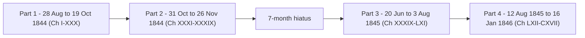
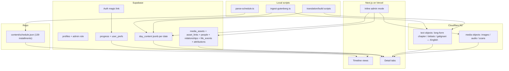

# Count of Monte Cristo — Immersive Timeline Experience

## Vision

A self-paced, individual, immersive reading experience that takes you back to 1840s Paris. The app follows the original newspaper serialization from [`monte-cristo-serialization-schedule.md`](/Users/ashleyyoung/count-of-monte-cristo/monte-cristo-serialization-schedule.md): **139 installments, 28 Aug 1844 – 16 Jan 1846**, across 4 parts with the real 7-month hiatus as a visible gap in the timeline.

Readers browse the full timeline freely, toggle between a horizontal card view and a vertical scroll view, open per-date detail pages with tabbed historical content, check off completed days (with sign-in), and deep-link to any installment or tab.

### Key decisions

- **Auth + progress:** Supabase magic-link accounts. Viewing needs no account; tracking progress does. Checking off days, last-location, and cross-device sync require sign-in.
- **Content storage:** Binary media (scans, audio, images) and long-form text live on **Cloudflare R2**. An **inline admin mode** (a role-gated toggle that makes the live pages editable in place, no separate panel) handles media uploads and content management; **local scripts** produce translated text files and push them to R2. Supabase holds a **`day_content` document per date** (jsonb, grouped by tab/section) plus relational tables for reusable media and the people graph. The repo keeps only the structural schedule (`content/schedule.json`).
- **English content; the original as artifact.** Displayed editorial content is **English only** — we do not show French transcriptions. The original 1844–46 paper is presented as the artifact itself: hosted **scan images of the four-page issue** plus a **link to the Gallica issue**. Per the content playbook ([`count-of-monte-cristo-experience-content-playbook.md`](/Users/ashleyyoung/count-of-monte-cristo/count-of-monte-cristo-experience-content-playbook.md)), the schema records enough provenance (Gallica permalink, IIIF region on scans, license, attribution) to reproduce and verify each image. The playbook is the editorial companion to this build plan; the scaffolding here must support its workflow directly.
- **Always link to sources.** Every text excerpt, image, recording, biography, and translation displays a visible attribution with an outbound link to its origin. Source URL + license + attribution are required fields on every content/media row and are rendered in the UI; nothing ships without a traceable, clickable source.

> **Note on the playbook's model.** The playbook is written against the older reading-month / club "clippings" framing with normalized tables and join tables. In this plan its content maps onto the **installment-date** timeline (one Gallica issue date = one installment) and onto a **per-date `day_content` document** rather than a normalized `clippings` table; its provenance fields (§8) are kept per item inside the document, while reuse and cross-linking move to `media_assets` + `asset_links` and the people graph below.

---

## Current scaffold (already done, keep)

| Area                                    | Status       | Files                                                                                                                                                                                                                                                                                                                                                                                                                                     |
| --------------------------------------- | ------------ | ----------------------------------------------------------------------------------------------------------------------------------------------------------------------------------------------------------------------------------------------------------------------------------------------------------------------------------------------------------------------------------------------------------------------------------------- |
| Next.js 16 + TS + Turbopack (port 3001) | Done         | `app/`, `next.config.ts`, `tsconfig.json`                                                                                                                                                                                                                                                                                                                                                                                                 |
| Supabase SSR                            | Done         | [`lib/supabase/client.ts`](/Users/ashleyyoung/count-of-monte-cristo/lib/supabase/client.ts), [`server.ts`](/Users/ashleyyoung/count-of-monte-cristo/lib/supabase/server.ts) (incl. `createAdminClient`), [`middleware.ts`](/Users/ashleyyoung/count-of-monte-cristo/lib/supabase/middleware.ts), [`proxy.ts`](/Users/ashleyyoung/count-of-monte-cristo/proxy.ts)                                                                          |
| Env + R2 config                         | Done         | [`.env.example`](/Users/ashleyyoung/count-of-monte-cristo/.env.example) (Supabase + R2 S3 creds, bucket `count-of-monte-cristo-experience`)                                                                                                                                                                                                                                                                                               |
| Deploy docs                             | Done         | [`README.md`](/Users/ashleyyoung/count-of-monte-cristo/README.md) (Vercel GitHub integration)                                                                                                                                                                                                                                                                                                                                             |
| Fonts + base CSS                        | Needs update | Current scaffold has Cormorant Garamond + Source Sans 3; **replace** with the Direction 1 stack — `UnifrakturMaguntia`, `Bodoni Moda`, `EB Garamond`, `IM Fell English`, `Cormorant Garamond` — in [`app/layout.tsx`](/Users/ashleyyoung/count-of-monte-cristo/app/layout.tsx); replace tokens in [`app/globals.css`](/Users/ashleyyoung/count-of-monte-cristo/app/globals.css) with the Phase 6 parchment/ink/gilt palette (see Phase 6) |
| Source schedule                         | Present      | [`monte-cristo-serialization-schedule.md`](/Users/ashleyyoung/count-of-monte-cristo/monte-cristo-serialization-schedule.md)                                                                                                                                                                                                                                                                                                               |

Landing page [`app/page.tsx`](/Users/ashleyyoung/count-of-monte-cristo/app/page.tsx) will be replaced by the timeline. Styling continues as plain CSS + variables (no Tailwind) unless you say otherwise.

---

## Core concept: the installment timeline

The timeline unit is an **installment** (one newspaper appearance on a specific historical date), not a chapter. There are 139, each carrying one or more chapters (some `(cont.)`). The 4 parts and the hiatus are first-class timeline structure.



Each installment date anchors curated content: chapter text, translated Debats sections, the original-paper scans, Galignani news, highlights, images, and audio.

---

## Data flow and storage



**Content resolution per date:** the app reads one `day_content` document for the installment date (its tab/section payload already grouped), fetches any long-form text bodies it references from R2, and resolves media keys to URLs. Reusable media and the people graph come from the relational tables. This keeps the read path to one document read plus a small set of indexed lookups.

### Why hybrid (not fully normalized)

Per-date editorial content is fixed, read-mostly, and always loaded a whole day at a time, so it lives as a **single structured document** rather than many normalized rows. Relational modeling is reserved for the data that genuinely cross-links: **reusable media** (one asset on many dates/people) and the **people graph** (relationships, life events, bylines). This avoids join-heavy schema for prose while keeping cross-date queries (e.g. "every music piece Berlioz wrote") available through `contributor_attributions` and `asset_links`.

---

## Target structure

```
count-of-monte-cristo/
├── app/
│   ├── page.tsx                       # timeline (toggle: horizontal | vertical)
│   ├── day/[date]/page.tsx            # per-date detail with tabs
│   ├── people/[slug]/page.tsx         # contributor profile (life timeline, own words, portraits, writing, connections, family)
│   ├── debats/page.tsx                # paper hub: tab1 paper profile, tab2 network graph, tab3 gallery + overlapping lives
│   ├── actions/admin.ts               # server actions backing inline admin mode (Zod-validated writes; admin-only via RLS)
│   ├── (auth)/login/page.tsx          # magic-link login (only needed for progress)
│   └── auth/confirm/route.ts
├── components/
│   ├── timeline/                      # HorizontalCards, VerticalScroll, DateSelector, ViewToggle, ProgressCheck
│   ├── day/                           # Tabs, OverviewTab, ChapterTab, DebatsTab, ArtTab, ScienceTab, OriginalPaperTab, GalignaniTab, PoliticsCompare, ScanViewer, ContributorByline
│   ├── people/                        # ContributorProfile, ProfileTabs, PortraitGallery, RelationshipGraph, LifeTimeline
│   ├── debats/                        # PaperProfile, NetworkGraph, VignetteGrid, StackedTimelines
│   ├── admin/                         # global inline-edit layer: AdminModeToggle, EditableText, EditableList, AddItemButton, ItemEditor, MediaPicker, MediaUploadField, GraphEditOverlay
│   └── ui/                            # AudioPlayer, etc.
├── lib/
│   ├── supabase/                      # exists
│   ├── installments.ts               # load schedule, next/prev, by-date
│   ├── progress.ts                    # signed-in progress (Supabase)
│   ├── content.ts                     # load day_content doc + linked media_assets -> grouped tabs + R2
│   ├── gallica.ts                     # date->issue ark, IIIF region URLs, ALTO/texteBrut helpers
│   ├── r2-server.ts                   # port from stock-tracker (read + write)
│   └── media.ts                       # key -> URL
├── content/
│   └── schedule.json                 # 139 installments, ordered, parts, hiatus (repo)
├── scripts/
│   ├── parse-schedule.ts             # md -> content/schedule.json
│   ├── ingest-gutenberg.ts           # chapter text -> R2 + day_content
│   ├── gallica/                      # date->issue, IIIF scans/crops, ALTO -> R2 + day_content/media_assets
│   └── translate/                    # crop -> OCR -> DeepL -> post-edit -> R2 + day_content
└── supabase/migrations/
    └── ..._initial.sql               # profiles, progress, user_prefs, day_content, media_assets, asset_links, people, relationships, life_events, contributor_attributions, RLS
```

---

## Phase 1 — Content model and schedule data

**Goal:** A typed, ordered installment dataset and navigation, plus chapter text on R2.

1. **`scripts/parse-schedule.ts`** parses [`monte-cristo-serialization-schedule.md`](/Users/ashleyyoung/count-of-monte-cristo/monte-cristo-serialization-schedule.md) into `content/schedule.json` (repo): 139 installments, each with `date` (ISO), `index` (1-139), `part` (1-4), `chapters` (`[{roman, title, cont}]`), label; plus part metadata and the hiatus marker.
2. **`scripts/ingest-gutenberg.ts`** downloads the public-domain text (Gutenberg #1184), splits into chapters, writes each chapter body as an R2 text object, and writes the chapter reference into the `day_content` document of the installment(s) that introduced it (handling `(cont.)` spans). Run locally with the service role.
3. **`lib/installments.ts`**: typed loaders (`getAll`, `getByDate`, `getByPart`), `getNext`/`getPrev` (correct across part/hiatus boundaries). `date-fns` for parsing/formatting only.

**Acceptance:** `content/schedule.json` has 139 ordered installments matching the md; chapter text objects exist on R2 and are indexed; navigation helpers return correct neighbors across boundaries.

---

## Phase 2 — Supabase: auth, profiles, progress, content index

**Goal:** Optional login, admin role, per-user progress, and the content index.

- **Auth UI:** `/login` (`signInWithOtp`) + `/auth/confirm/route.ts`. Viewing is fully open; the check-off / progress UI prompts sign-in when anonymous.
- **Migration:**
  - `profiles(id, role admin|member default member, display_name, created_at)` + on-signup trigger.
  - `progress(user_id, installment_date, completed_at)`.
  - `user_prefs(user_id, last_location date, view_pref text default 'horizontal')`.
  - `day_content` — one row (document) per installment date holding the whole day's editorial payload as `jsonb`, grouped by tab/section so a detail page is a single read:
    - `installment_date` (pk), `doc jsonb`, `updated_by`, `updated_at`.
    - `doc` shape (English-only): top-level `{ gallica_issue_url, feuilleton_strip, original_pages, overview, chapter, debats: { music, theater, art, literature }, art_exhibitions, science, galignani }`. `gallica_issue_url` links the original issue; `feuilleton_strip` is a single `image` item (page-1 strip crop) or `null`; `original_pages` is `image[]` (the four-page scans for the Original paper tab). Each section is an array of discriminated-union items keyed on `kind`: `text` `{ text_r2_key, source, original_date, gallica_url, license, attribution }`, `image` `{ media_asset_id, caption }`, `audio` `{ media_asset_id, work_title, composer, audio_license }`. No French transcriptions are stored; prose is English on R2. See Sprint 1 for the authoritative schema + Zod validation.
    - Short text inlines into `doc`; long-form bodies (full chapter text, long translations) stay as R2 objects referenced by `r2_key`. Every item still carries full provenance (playbook §3, §8).
  - `media_assets` — reusable supplementary media (one engraving/portrait/caricature can attach to many dates and people): `id, kind (illustration|portrait|caricature|playbill|architecture|novel_plate), title, source, source_url, iiif_region, license, attribution, r2_key, created_at`.
  - `asset_links(media_asset_id, target_type (installment|person|chapter), target_key, tab, section, sort_order)` — polymorphic join so a reusable asset surfaces on the relevant dates, profiles, or chapters. (Replaces the per-target join tables the playbook sketched.)
  - `people` — master node table for everyone in the experience: the Débats writers **and** the famous connections (composers, authors, royalty, world leaders). `id, slug, name, is_contributor bool, beat (music|drama|art|literature|science|politics|foreign|economics|direction, null for non-contributors), birth, death, bio_md_r2_key, autobio_md_r2_key, portrait_media_asset_id, sources jsonb (links + licenses), created_at`. Contributors are `people` with `is_contributor=true` and full profiles; connection-only figures can be lighter nodes.
  - `contributor_attributions(person_id, installment_date, section)` — which writer authored a given section on a date, so a day's byline links to the profile and a profile can list "their pieces in this run."
  - `relationships(from_person, to_person, kind (family|romantic|friend|rival|mentor|collaborator|patron|royalty|professional), label, description, start_year, end_year, sources jsonb)` — edges for the relationship graph. Directed where it matters (mentor→student, patron→artist); symmetric kinds stored once. A normalized unique index `(least(from,to), greatest(from,to), kind)` prevents duplicate edges.
  - `life_events(id, person_id, event_date date, precision (day|month|year), title, description, kind (birth|death|work|appointment|award|publication|premiere|discovery|personal), sources jsonb)` — notable dates per person (birth and death required, plus other key milestones) that power the profile timeline dots and the stacked multi-life timeline. `people.birth`/`people.death` remain the canonical span; `life_events` carries the milestones in between.
  - `graph_layout(variant, person_id, x, y, updated_at, pk(variant,person_id))` + `graph_variants(key pk, label, params jsonb, published, is_default, sort)` — canonical persisted coordinates for the whole-network `/debats` graph, so every viewer sees identical node positions. The global graph has no focal node, so coordinates come from a deterministic **structural embedding** in `lib/graph-layout.ts` (BFS distances → category cohesion → classical MDS init → SMACOF → component packing → fit-aspect → organic push-apart), recomputed for every registered variant and Procrustes-aligned to the prior layout on admin edits. Multiple variants (e.g. structural / beat-soft / beat-grouped) can be previewed and published with a switcher. Ego graphs on profiles have a focal node and are computed live, not stored.
- **RLS:** progress/user_prefs are per-user. `day_content`, `media_assets`, `asset_links`, `people`, `relationships`, `life_events`, `contributor_attributions`, `editorial_blocks`, and `graph_layout` are readable by anyone (incl. anon) for open viewing; writable only by admins. `profiles` role not self-assignable.
- **`lib/progress.ts`:** signed-in reads/writes via Supabase. **`lib/content.ts`:** load the `day_content` document for a date plus any `asset_links` for that installment, returning grouped tab/section content, the page scans (`original_pages`), and the `gallica_issue_url`.

**Acceptance:** Anonymous users browse content; signing in enables check-off, last-location, and view-pref sync; admin-only RLS write policies reject non-admin writes to content tables; first admin seeded manually. The `day_content` document for a date stores English prose on R2, the four-page scans + feuilleton-strip crop as media_assets, and the Gallica issue link, with IIIF region + license/attribution provenance.

---

## Phase 3 — Timeline interface (core)

**Goal:** Toggleable timeline with both views, anchors, deep links, auto-navigation.

### View toggle

Persist choice in `view_pref` when signed in (local UI state otherwise). `ViewToggle` switches views.

---

### Horizontal card view — Period Navigation

This is the **Horizontal Period Navigation** from `monte-cristo/Monte Cristo Experience.html`, re-skinned to Direction 1 sepia throughout. No "drag to travel the calendar" label.

**Page header** — `padding: 26px 36px`:

- `Bodoni Moda` 900 26px `var(--ink-primary)` — "The Season of 1844–46"
- Italic subtitle `var(--ink-muted)` — "One hundred and thirty-nine installments · 1844–46"

**Timeline ribbon** — `margin-top: 24px; padding: 0 36px`:

- 2px horizontal gilt line: `background: linear-gradient(90deg, transparent, var(--gilt-warm) 6%, var(--gilt-warm) 94%, transparent)`
- Scrollable day card row: `display: flex; gap: 14px; overflow-x: auto; padding-bottom: 14px` (native scroll, no drag hint label)

**Day cards** — `flex: none; width: 148px; padding: 13px 14px; border-radius: 2px; text-align: left; transition: transform .25s, box-shadow .25s`:

- Month: `Bodoni Moda` 700 13px `letter-spacing: 1px`
- Day number: `Bodoni Moda` 900 30px `line-height: 1`
- Chapter note: italic 12.5px
- **Inactive:** `background: var(--paper-card)`, `color: var(--ink-secondary)`, `border: 1px solid var(--rule-light)`; month/accent color `var(--gilt-deep)`; subtitle `var(--ink-muted)`
- **Active/selected:** `background: var(--gilt-warm)`, `color: var(--ink-primary)`, `border: 1px solid var(--gilt-warm)`, `box-shadow: 0 10px 26px rgba(201,162,75,.4)`; month/accent `var(--ink-primary)`; subtitle `var(--ink-primary)`

**Opened packet panel** — expands below the card row when a day is selected; `margin: 22px 36px 0; border: 1px solid var(--rule-mid); background: var(--paper-feature); padding: 24px 28px`:

- **Header row:** `display: flex; align-items: baseline; gap: 16px; border-bottom: 1px solid var(--rule-light); padding-bottom: 12px`
  - Date: `Bodoni Moda` 900 24px `var(--gilt-warm)`
  - Chapter: italic `var(--ink-secondary)`
  - Right-aligned attribution: `ui-monospace` 11px `var(--ink-muted)` — "Journal des Débats · 28 Août 1844"
- **Five content mini-cards** — `display: grid; grid-template-columns: repeat(5, 1fr); gap: 16px; margin-top: 18px`. Each card: `border: 1px solid var(--rule-light); padding: 12px; background: var(--paper-card); min-height: 140px`:
  - Category label: `IM Fell English` italic 11px `var(--gilt-warm)` `letter-spacing: 1px` — "FEUILLETON", "♪ MUSIC", "THEATRE", "POLITICS", "ANNONCE"
  - Title: `Bodoni Moda` 700 15px `var(--ink-primary)`
  - Subtitle: italic 13px `var(--ink-muted)`
- **CTA:** `IM Fell English` 15px "Open this day →" — `background: var(--ink-primary)`, `color: var(--paper-card)`, `border: none`, `padding: 11px 26px`; `margin-top: 18px`

**Linear date selector** — a non-calendar scrubber strip above the card row (matches "linear timeline date selector at the top of the page" requirement), spanning the full 1844–46 date range with part-band markers (Part 1, hiatus gap, Part 2) and a scrolling position indicator. Clicking a position on the scrubber jumps the card scroll position.

---

### Vertical scroll view

Bird's-eye layout mirroring the schedule file: Part headers, the hiatus block, then a section per date with date, chapters, teaser, and completion checkbox. All section fonts use the Direction 1 sepia palette; Part headers use `UnifrakturMaguntia` or `Bodoni Moda` display treatment.

---

### Anchors and deep links

Each installment has `id="d-<date>"` (e.g. `#d-1844-09-06`). Vertical view honors `/#d-...`; horizontal view reads `?date=` to position the carousel. Shareable in both.

### Auto-navigate to last checked-off

For signed-in users, read `last_location` on load; horizontal view positions to that card, vertical view scrolls to its anchor. Checking a day updates `last_location`.

**Acceptance:** Toggle persists; card row scrolls and cards are clickable; selected card opens its packet panel with five mini-cards in sepia newspaper style; date scrubber positions the card row; vertical view scrolls full timeline with hiatus gap; deep links resolve in both; signed-in users auto-position to last completed day.

---

## Phase 4 — Detail pages with tabs

**Goal:** Per-date immersive detail page using the layout from `monte-cristo/Monte Cristo Experience.html` (Day Experience section), fully re-skinned to Direction 1 sepia — not the blue Direction 2 shown in the design file's Day Experience screen.

### Layout: `app/day/[date]/page.tsx`

**Top bar** — full-width, `border-bottom: 1px solid var(--rule-mid)`, `background: rgba(120,84,40,.06)`, `padding: 16px 32px`:

- Left: `Bodoni Moda` 900 `Session N` label (`var(--gilt-warm)`) · italic subtitle `Marseille · Chapters I–V` (`var(--ink-muted)`)
- Center: `Bodoni Moda` italic date `Wednesday · 28 August 1844` (`var(--ink-secondary)`)
- Right: completion checkbox + prev/next installment controls

**Three-column grid:** `grid-template-columns: 300px 1fr 318px`, `min-height: 680px`

---

**LEFT column (300px) — feuilleton strip panel**

Background: `var(--paper-feature)` (`#e7dcc4`). Right border: `3px double var(--rule-mid)`.

- Label: `IM Fell English` italic, `font-size: 12px`, `color: var(--ink-muted)`, `letter-spacing: 1px` — "THE VERY STRIP · Débats, 28 Aug 1844"
- Scan frame: `border: 1px solid var(--rule-mid)`, `padding: 10px`, `background: var(--paper-card)`, `box-shadow: inset 0 0 30px rgba(120,84,40,.18)`. The framed content is the **scan image** of the page-1 feuilleton strip (`doc.feuilleton_strip` → media_assets → R2) — the real artifact, not transcribed French text. When a date has no strip crop, show a muted "see the original on Gallica" placeholder.
- Attribution: `ui-monospace`, `font-size: 10px`, `color: var(--ink-muted)`, centered — "Source: gallica.bnf.fr / BnF"
- CTA: "View full page scan ⤢" — `IM Fell English`, full-width, `background: var(--ink-primary)`, `color: var(--paper-card)`, `border: none`

---

**CENTER column (1fr) — reading column**

Background: `var(--paper-base)`. Padding: `38px 56px`.

- Chapter label: `Bodoni Moda` italic, `font-size: 14px`, `color: var(--gilt-warm)`, `letter-spacing: 3px`, `text-transform: uppercase`
- `h2` title: `Bodoni Moda` 700, `font-size: 42px`, `color: var(--ink-primary)`
- Large drop-cap: `Bodoni Moda` 700, `font-size: 74px`, `line-height: .74`, `float: left`, `padding: 6px 12px 0 0`, `color: var(--gilt-warm)`
- Body paragraphs: `EB Garamond`, `font-size: 19px`, `line-height: 1.72`, `color: var(--ink-secondary)`, `max-width: 620px`, `text-align: justify`
- CTAs: "Continue reading →" — `IM Fell English`, `background: var(--gilt-warm)`, `color: var(--ink-primary)`. "Listen to this chapter" — italic outline, `border: 1px solid var(--ink-primary)`, `color: var(--ink-primary)`

Below the reading text, **tab row** for the full content (Overview / Chapter / Débats / Art & exhibitions / Science / Original paper / Galignani) — `IM Fell English` labels, active tab underlined with `var(--gilt-warm)`.

---

**RIGHT column (318px) — "Paris, that day" sidebar**

Background: `var(--paper-card)`. Left border: `1px solid var(--rule-mid)`. Padding: `22px 20px`. `display: flex; flex-direction: column; gap: 14px`.

Section heading: `Bodoni Moda` italic, `font-size: 15px`, `letter-spacing: 2px`, `text-transform: uppercase`, `color: var(--gilt-warm)` — "Paris, that day"

Each card uses `border: 1px solid var(--rule-light)`, `background: rgba(120,84,40,.04)`, `padding: 12–13px`:

- **Music card:** `♪ MUSIC · reviewed by Berlioz` label (`IM Fell English` italic, `var(--gilt-warm)`, 13px). Title `Bodoni Moda` 18px. Subtitle italic `var(--ink-muted)`. Play button (circle, `var(--gilt-warm)` fill), animated EQ bars. Attribution chip: `ui-monospace` 10px `var(--ink-muted)` — "CC · Musopen".
- **Theatre card:** Playbill image strip (parchment-striped placeholder, `background: var(--paper-feature)`). `THEATRE · Janin's review` label. Title `Bodoni Moda` 16px.
- **Politics pair:** `POLITICS · two papers, one event` label. `grid-template-columns: 1fr 1fr`: left cell `background: var(--paper-feature)`, right cell `background: #dfe5e0` (Galignani's English paper — deliberate slight tonal difference). `EB Garamond` 11px. Cell headers `Bodoni Moda` bold.
- **Annonce:** `ANNONCE · p.4` label. Ad text: `Bodoni Moda` 700 uppercase heading, italic subline — period advertisement.

---

### Tab content (all tabs share the 3-column chrome; center column content changes)

1. **Overview** — highlights; feuilleton strip teaser; teasers for each sidebar section.
2. **Chapter text** — full reading column (drop-cap, body, CTAs); strip scan in left column.
3. **Débats (translated)** — arts/letters sub-sections (music, theater, art, literature), each shown as an **English translation** with a "view original on Gallica" link (playbook §1, §5). Art sub-section draws on Delécluze's Salon reviews and the Salon livret (see sourcing references).
4. **Art & exhibitions** — visual arts context from the three major institutions:
   - Louvre/Salon: 1844 livret (2,423 works), featured works, Delécluze reviews paired with livret entries and open-access images. Cross-links to Delécluze profile.
   - Musée de Cluny (opened 17 March 1844 — during Part 1 of the run): founding catalog (`ark:/12148/bpt6k6524967g`), du Sommerard collection highlights.
   - Versailles/Musée de l'Histoire de France: Crusades room commissions.
5. **Science & advancements** — Foucault/Donné Débats feuilletons, Académie des Sciences reports; English translation + Gallica link; byline links to profiles.
6. **Original paper** — the full four-page issue scans (`original_pages`) in a viewer, plus a prominent link to the Gallica issue (`gallica_issue_url`). This is how the untranslated original is presented: the artifact itself, not transcribed text.
7. **Galignani** — English-expat news; Débats vs Galignani side-by-side comparison where events overlap (playbook §5c).

Every image shows source/attribution with a Gallica permalink. Each section shows a contributor byline (`contributor_attributions`) linking to the profile. Tabs deep-linkable: `/day/1844-09-06?tab=science`. Prev/next navigation reuses `lib/installments.ts`; completion checkbox writes progress (prompts sign-in if anonymous).

**Acceptance:** The three-column chrome renders in sepia; the left strip panel displays the feuilleton-strip scan image; the center reading column has a large gilt drop-cap; the right sidebar shows Music, Theatre, Politics pair, and Annonce cards; all seven tabs switch and deep-link; content is English with a Gallica link to the original; the Original paper tab shows the four-page scans; tab + date URL-addressable; adjacent-installment navigation works.

---

## Phase 4b — Contributor profiles (critics, writers, scientists)

**Goal:** Profile pages for the recurring Débats contributors, deepening immersion by showing who shaped the paper's voice. The bylines are consistent across 1844–46, so a reader can follow the same writers week to week alongside the novel. This spans not only the arts critics but the science, politics, and economics writers, which feeds the Science & advancements tab (Phase 4).

**Scope: profiles are full life stories, not date-bound.** The day/timeline immersive content stays inside the 1844–46 serialization window, but a contributor profile spans the person's **whole life** — personality, achievements (including those after 1846), family/genealogy, and historical relevance. Foucault's pendulum (1851), speed-of-light measurements, and gyroscope belong on his profile even though they postdate the run; the Science tab for a given 1845 date shows only what the Débats actually covered then. The profile is the place for the full arc; the timeline is the place for the contemporaneous moment.

### The roster (1844–46, research-confirmed)

Arts and letters:

- **Jules Janin** — drama/theatre, "the Prince of Critics" (Débats 1830–1873).
- **Hector Berlioz** — music feuilleton (1834–1863): concerts and lyric theatres.
- **Étienne-Jean Delécluze** — art/Salon criticism and the Théâtre-Italien (1781–1863).
- **Silvestre de Sacy** (Samuel-Ustazade) — literary criticism (1801–1879).
- **Philarète Chasles** — foreign/English literature (1798–1873).

Science:

- **Léon Foucault** — science feuilleton / editor of the scientific section from 1845 (1819–1868). _The_ example for the advancements tab (pendulum, speed of light, daguerreotype work with Fizeau).
- **Alfred Donné** — Académie des Sciences proceedings for the Débats from 1829, Foucault's mentor and predecessor on the science beat; known for the blood platelet and early micro-photography (1801–1878).

Politics, foreign affairs, economics:

- **Saint-Marc Girardin** — conservative political/literary voice, Sorbonne professor (1801–1873).
- **John Lemoinne** — foreign policy and English affairs (on staff from 1840, ~50 years; 1815–1892).
- **Michel Chevalier** — economics, free trade, ex-Saint-Simonian (1806–1879).
- **Alfred-Auguste Cuvillier-Fleury** — literary/political (1802–1887).

Ownership/direction (context, lighter profiles):

- The **Bertin family** owned and ran the paper; **Armand Bertin** directed it in the 1840s.

**Build all of these profiles at launch** (full profiles, not stubs): Janin, Berlioz, Delécluze, Sacy, Chasles, Foucault, Donné, Saint-Marc Girardin, Lemoinne, Chevalier, Cuvillier-Fleury, and Armand Bertin (direction). The curator confirms exact beat-by-date via the playbook; `contributor_attributions` records who wrote which section on each date.

### Pages — `app/people/[slug]/page.tsx`

A **life timeline band** sits near the top of every profile: a horizontal axis from birth to death with **hoverable dots** on notable dates (from `life_events`). Hover shows the event title/date/short description with a source link; clicking a dot can scroll to the related profile section or open the event detail. Birth and death anchor the ends.

Tabbed profile mirroring the immersive style; the full life, not just the serialization years:

1. **Life** — full biography across the whole life span, plus a personality sketch; birth/death and other key dates called out (public-domain prose, see sources).
2. **In their own words** — autobiographical/primary excerpts (Berlioz's _Mémoires_; Janin's essays and letters; Foucault's own science feuilletons; each writer's columns as first-person voice).
3. **Portraits** — period portraits, Nadar/Carjat photographs, caricatures (`media_assets`, `kind=portrait|caricature`).
4. **Achievements & legacy** — career achievements and historical relevance across their whole life, including post-1846 work (e.g. Foucault's 1851 pendulum, speed of light, gyroscope); for writers, major works and influence.
5. **Their Débats writing** — list of their attributed sections across the 1844–46 timeline (`contributor_attributions`), each linking back to the relevant day/tab.
6. **Connections** — an interactive **relationship graph** centered on this person, showing close relationships to other famous people and, where interesting and relevant, royalty or world leaders (e.g. Berlioz ↔ Liszt/Chopin/Harriet Smithson; Janin's literary circle; Cuvillier-Fleury ↔ the duc d'Aumale; Saint-Marc Girardin/Chevalier ↔ Guizot and the July Monarchy). Nodes link to profiles where one exists; each edge carries a labelled relationship, a short description, and source links.
7. **Family & genealogy** — family, relationships, and genealogical data, with outbound source links.

### Relationship graph

The graph is its own workstream — see the **Graph Engine plan** (`mc_graph_engine_*.plan.md`) for the full algorithm, renderer, variants, and edit overlay. In brief:

- **Deterministic, app-computed, never an image.** A pure `lib/graph-layout.ts` produces coordinates; the app renders SVG (scales via `viewBox`; no stored image). Global graph (no focal node) is positioned by structure (BFS distances → category cohesion → classical MDS → SMACOF → component packing → organic push-apart); the ego graph (focal node) is the profile owner centered with neighbors in rings.
- Nodes sized by degree, colored by beat/`category`, contributors gilt-ringed; edges link to sources. The cohesion knob yields named **variants** that can be previewed, published, and switched.
- Per-profile **Connections** tab = live ego graph. The Débats hub Tab 2 = whole-network view from the persisted `graph_layout` (recomputed + Procrustes-aligned on admin edits) so every viewer shares one canonical layout.

Bio/autobio text lives on R2 (`bio_md_r2_key`, `autobio_md_r2_key`); portraits via `media_assets`. Cross-linked both ways: day section bylines → profile, and profile → the days they wrote.

**Always link to sources.** Every profile, every excerpt, and every media asset displays a visible source/attribution with an outbound link to its origin (Gallica permalink, hberlioz.com page, archive.org item, Wikisource/Britannica entry, Wikimedia Commons file, data.bnf.fr/Wikidata record). The `people.sources jsonb`, the `relationships.sources jsonb`, and the per-asset `source_url`/`gallica_url` + `license` + `attribution` fields are required, not optional; the UI renders a "Sources" block on each profile and an attribution line under each image/quote. Nothing ships without a traceable source.

### Sourcing (public domain; record source + license per asset)

- **Biography (reusable prose):** **1911 Encyclopædia Britannica** via Wikisource (public domain) where available; Wikipedia for orientation (CC BY-SA, so paraphrase rather than copy). Entries exist for Janin, Berlioz, Delécluze, Foucault, Saint-Marc Girardin, Chevalier, Chasles.
- **Autobiographical / primary:**
  - Berlioz — _Mémoires_ (FR + EN) and ~400 Débats feuilletons on **hberlioz.com**; scans on **archive.org** (`mmoiresdehecto00berl`).
  - Janin — works/essays on **Project Gutenberg** and **Gallica**; _Histoire de la littérature dramatique_.
  - Foucault / Donné — science feuilletons in the Débats themselves (Gallica); Foucault's papers in the _Comptes rendus_ (1847–1869); Donné/Foucault _Cours de microscopie_ + atlas (Gallica, 1844–45).
  - Delécluze, Sacy, Chasles, Saint-Marc Girardin, Chevalier, Lemoinne, Cuvillier-Fleury — works on **Gallica**; bios via Britannica 1911 / data.bnf.fr.
- **Portraits & images:** **Wikimedia Commons** (Nadar and Carjat photographs are public domain), **Gallica (BnF)**, **data.bnf.fr** (authority records aggregating portraits + works + links), **Paris Musées Open Content**, **The Met Open Access**, Clark Art Institute (Nadar's Janin).
- **Genealogy / structured data:** **Wikidata** (dates, relations, identifiers), **data.bnf.fr**, Geneanet where applicable.
- **Works / catalogue:** data.bnf.fr, Gallica, Wikisource; **IMSLP** for Berlioz scores; **Comptes rendus de l'Académie des sciences** (Gallica) for Foucault/Donné.

**Acceptance:** All listed contributors have full profiles with a birth-to-death life timeline of hoverable, sourced dots, bio, an autobiographical excerpt, at least one portrait, and a list of their attributed Débats pieces linking into the timeline; each profile's Connections tab renders an ego relationship graph with sourced edges; day sections show a byline linking to the profile; every profile, excerpt, edge, and asset renders a visible, clickable source link with license/attribution.

---

## Phase 4c — The Journal des Débats page (the paper's own hub)

**Goal:** A top-level page profiling the newspaper itself and tying the people together. Route: `app/debats/page.tsx`, three tabs.

### Tab 1 — The Paper

The profile of the publication: when it was founded and by whom (founded 1789; long owned and led by the **Bertin family**), how it evolved through the Revolution, Empire, Restoration, and July Monarchy, its Orléanist/establishment alignment, and its role as the most-read paper of the era and a major force in French culture and literature. Include relevant context and trivia for understanding its place in society. Sourced prose (1911 Britannica / Wikipedia-for-orientation), with period scans/mastheads from Gallica and visible source links.

### Tab 2 — Connections graph

The whole-network relationship graph over all `people` (the global view referenced in Phase 4b): an **SVG** graph positioned by the persisted, deterministic `graph_layout` (canonical, recomputed + Procrustes-aligned on admin edits), nodes sized by degree and colored by beat/`category` with contributors gilt-ringed, click to open a profile or popover, reduced-motion fallback to a list. A switcher exposes published layout variants. Every edge links to its source.

### Tab 3 — People gallery + overlapping lives

Includes **all `people`** (the Débats contributors **and** the famous connections: composers, authors, royalty, world leaders), so the reader sees the whole milieu. **Contributors are starred/flagged** so they stand out from connection-only figures.

- **Framed vignette grid** of all people: portraits in period-style frames (gilt/oval/playbill motifs), with a tasteful, slightly 3D/immersive treatment (subtle depth, hover lift, parallax) matching the site's collage-theatre aesthetic. Contributors carry a **star/badge** (driven by `people.is_contributor`); a filter toggles "contributors only" vs "everyone." Each vignette links to its profile (or popover for figures without one).
- **Stacked life timelines:** below (or toggled with) the grid, each person's life renders as a horizontal **birth→death track** on a single shared time axis, stacked so you can see how their lives overlapped (e.g. who was alive and active during the 1844–46 run). Contributor tracks are starred/styled distinctly. Notable `life_events` appear as dots on each track.
  - Each track can be **selected/deselected** (toggle visibility) and **dragged and dropped to reorder** (e.g. `dnd-kit`) so the reader can focus and compare specific lives; the shared axis rescales to the visible set. A quick "contributors only" filter trims noise.
  - A marker highlights the 1844–46 serialization window across all tracks.
  - Reduced-motion fallback: static stacked bars without drag animations.

(If including everyone proves too noisy, the `is_contributor` star + the "contributors only" filter let us default to contributors and reveal the rest on demand; refine later.)

**Acceptance:** The Débats page renders all three tabs; the paper profile is sourced; the network graph is explorable; the gallery shows framed vignettes for all people with contributors clearly starred and a contributors-only filter; the stacked timelines show overlapping lifespans with selectable, drag-to-reorder tracks and a highlighted serialization window; all text/images/edges link to sources.

---

## Phase 5 — Inline admin mode, Gallica pipeline, and media (R2)

**Goal:** Produce originals-first content on R2 via local scripts and inline admin mode, following the playbook.

### R2 + media helpers

- Port [`stock-tracker/dashboard/lib/r2-server.ts`](/Users/ashleyyoung/stock-tracker/dashboard/lib/r2-server.ts) → `lib/r2-server.ts` with **read and write** (`getR2Object`, `putR2Object`, public/signed URL via `R2_PUBLIC_URL`). `lib/media.ts` resolves keys to URLs.

### Gallica scan/crop pipeline (`scripts/gallica/`)

Implements playbook §2–§3 so curators can pull originals from this file alone:

- Resolve an installment `date` → issue ark via the Gallica Issues service (`/services/Issues?ark=...&date=YYYY`).
- Pull page scans and crops via the **IIIF Image API v1.1** (quality token `native`): full page, scaled, pixel-region `x,y,w,h`, or `pct:` region; read `info.json` for dimensions.
- Optionally fetch **ALTO XML** OCR for bounding boxes (`<Illustration>`/text blocks) to derive crop regions automatically.
- Download at high resolution, push to R2, and store the resulting `r2_key` **plus the `iiif_region` string + `gallica_url`** in the `day_content` item (or `media_assets` for reusable assets).

### Translation pipeline (`scripts/translate/`)

Implements playbook §4, **English output only** (no French transcription is stored or shown): get French text (Gallica `texteBrut`, falling back to Tesseract `fra` / Transkribus on the crop) as an in-memory intermediate → machine-translate FR→EN (DeepL primary) → light human post-edit → store **the English translation** on R2 with permalink, source, date. Writes a `text` item into the date's `day_content` document via the service role. The original itself is preserved separately as page scans (`original_pages`) + the `gallica_issue_url`.

### Inline admin mode (global, no separate panel)

- A role-gated **"Admin mode"** toggle (top-right of the chrome, renders only for `profiles.role = 'admin'`) makes **every page editable in place** — timeline/landing, day pages, profiles, and the Débats hub (including graphs and timelines). Off, you see exactly what readers see.
- Built from **shared edit primitives** every page composes: `EditableText`, `EditableList`/`AddItemButton` (edit/delete/drag-reorder via `dnd-kit`), `ItemEditor` (form generated from the shared Zod schema per entity/`kind`), `MediaPicker` + `MediaUploadField`, and `GraphEditOverlay` (add nodes → `people`, draw/edit/delete edges → `relationships`).
- Per surface: landing/timeline → masthead/hero copy + per-installment teasers; day → "+ Add" items within fixed tabs/sections (text/image/audio with provenance); profiles → bio/autobio/portrait/`life_events`/`relationships`/`contributor_attributions`; Débats hub → paper copy + the network graph + gallery + stacked timelines.
- Media: **upload** (streams to R2 + inserts `media_assets`) or **pick existing** via `MediaPicker` (paginated thumbnail grid, `pg_trgm` search over title/attribution/caption, `kind` chips, `tags` facets) to reuse one asset across dates and profiles.
- **Server Actions** (`app/actions/admin.ts`) cover every entity (`day_content.doc`, `media_assets`, `asset_links`, `people`, `life_events`, `relationships`, `contributor_attributions`, `editorial_blocks`): re-check the admin session, validate with Zod, write base tables (R2 for binaries/long-form text), then `router.refresh()` re-renders. Admin-only **RLS write policies** are the real authorization; the toggle is convenience only.

### Rendering

- Full-page scans as immersive backdrops/collage layers; feuilleton-strip crops as the "this is the strip readers saw" element; individual crops as clipping cards.
- Audio (period music) via `AudioPlayer` HTML5, gesture-gated. Recordings link out or embed when hosting license is unclear; store `audio_license` per track.

**Acceptance:** A curator can resolve a date to a Gallica issue, pull the four-page scans, push the English translation to R2, and have it render in the detail tabs with a Gallica link to the original; the stored `iiif_region` reproduces the feuilleton-strip crop; an admin can add/edit content in place via admin mode (upload or pick existing media); anonymous users see the result.

---

## Phase 6 — Immersive aesthetic pass

**Direction: "Aged paper & sepia ink · subtle"** — the exact aesthetic from `monte-cristo/Monte Cristo Experience.html` (Direction 1). The screenshot above is the canonical reference. Replicate it exactly: newspaper masthead layout, parchment ground, warm brown inks, period editorial typography, gilt accents.

### Typography — exact fonts (all on Google Fonts)

Load via `next/font/google` in [`app/layout.tsx`](/Users/ashleyyoung/count-of-monte-cristo/app/layout.tsx), replacing the current Cormorant Garamond / Source Sans 3 pairing:

| Role                        | Font                 | Weight / style                                  | Usage                                                             |
| --------------------------- | -------------------- | ----------------------------------------------- | ----------------------------------------------------------------- |
| Masthead / nameplate        | `UnifrakturMaguntia` | 400                                             | "Journal des Débats" masthead, `Débats` label chip                |
| Display / headline          | `Bodoni_Moda`        | 400, 500, 700 italic; 400, 500, 700, 900 normal | Novel title (`h2`), dates, section headers, brass-plaque captions |
| Body / running text         | `EB_Garamond`        | 400, 500                                        | All body prose, scan captions, tab text                           |
| Buttons / labels / captions | `IM_Fell_English`    | 400 italic + normal                             | CTAs, tab labels, attribution chips, small-cap subheadings        |
| Supporting display          | `Cormorant_Garamond` | 300–700                                         | Pull-quotes, chapter epigraphs, decorative sub-display            |

`IM_Fell_DW_Pica` is also loaded as an alternate for narrower column captions.

### Color tokens — exact values from the design file

Replace all tokens in [`app/globals.css`](/Users/ashleyyoung/count-of-monte-cristo/app/globals.css):

```css
:root {
  /* Paper grounds */
  --paper-base: #f1e8d2; /* outer page / body background */
  --paper-card: #efe6cf; /* newspaper card surface */
  --paper-feature: #e9dec4; /* featured / inset panel */
  --paper-deep: #e2d6ba; /* darkest paper tone */

  /* Inks */
  --ink-primary: #1d140a; /* near-black warm ink — headings, body */
  --ink-secondary: #3b2e1d; /* warm dark brown — subheadings, body alt */
  --ink-tertiary: #5b4631; /* medium brown — dates, rules, borders */
  --ink-muted: #6b5236; /* lighter brown — captions, meta */

  /* Borders / rules */
  --rule-strong: #5b4631;
  --rule-mid: #8a6f47;
  --rule-light: #b9a578;

  /* Gilt accents */
  --gilt-warm: #c9a24b; /* dates, gold highlights */
  --gilt-light: #e7c878; /* lighter gilt / halos */
  --gilt-deep: #a07f30; /* shadow side of gilt */

  /* Dark card (direction 2 / night mode) */
  --dark-surface: #16314f;
  --dark-card: #234a6e;
  --dark-text: #f3ead6;
  --dark-border: #2b3a55;

  /* Oxblood accent (curtain / editorial markers) */
  --oxblood: #7c2d2a;
}
```

### Layout patterns (replicate from design file)

- **Masthead strip:** three-column flex (`N.º 241 — Édition du Club` · `PARIS` · date); italic, `font-size: 13px`, `color: var(--ink-tertiary)`; bottom border `1px solid var(--rule-strong)`.
- **Nameplate:** `UnifrakturMaguntia`, `font-size: clamp(36px, 5vw, 58px)`, `color: var(--ink-primary)`, `letter-spacing: 1px`, centered, `margin: 16px 0 6px`.
- **Subtitle band:** italic, `font-size: 14px`, `color: var(--ink-tertiary)`, `letter-spacing: 2px`, `border-top: 1px solid`, `border-bottom: 3px double` — both `var(--rule-strong)`.
- **Hero grid:** `grid-template-columns: 1.55fr 1fr`, `gap: 40px`, `padding: 34px 60px 0`.
- **Novel title (`h2`):** `Bodoni Moda`, `font-weight: 700`, `font-size: clamp(42px, 5.5vw, 62px)`, `line-height: .96`, `color: var(--ink-primary)`. The word _de Monte-Cristo_ is `font-weight: 500; font-style: italic`.
- **Body copy:** `EB Garamond`, `font-size: 18px`, `color: var(--ink-secondary)`, `line-height: 1.55`, `max-width: 430px`.
- **CTAs:** `IM Fell English`, `font-size: 16px`, `letter-spacing: 1px`. Primary: `background: var(--ink-primary); color: var(--paper-card); border: none`. Secondary: italic, outline.
- **Image frames:** `border: 1px solid var(--ink-muted)`, `padding: 8px`, `background: var(--paper-feature)`, `box-shadow: 0 3px 14px rgba(60,40,20,.22)`.
- **Brass plaque:** `Bodoni Moda italic`, `font-size: 11px`, `background: linear-gradient(var(--gilt-warm), var(--gilt-deep))`, `color: var(--ink-secondary)`, `padding: 6px 10px`, `border-radius: 1px`, `box-shadow: 0 3px 7px rgba(0,0,0,.5), inset 0 1px 0 rgba(255,245,200,.6)`.
- **Attribution chip:** `ui-monospace`, `font-size: 11px`, `color: var(--ink-muted)`, `background: var(--paper-feature)`, `padding: 3px 7px`.

### Animation (Framer Motion)

- Card transitions / arrows in horizontal view.
- Staggered fade-ins on scroll in vertical view.
- Tab cross-fades on detail page.
- Collage-layer parallax on landing page hero (book cover tilted `rotate(-4deg)`, `drop-shadow(0 22px 26px rgba(0,0,0,.5))`).
- Respect `prefers-reduced-motion`; WCAG AA contrast throughout; keyboard-navigable timeline and tabs.

**Acceptance:** The landing page and timeline views match Direction 1 from the design file to visual inspection; masthead, nameplate, subtitle band, hero grid, and CTAs use the exact fonts and color tokens above; reduced-motion, keyboard nav, and WCAG AA contrast pass.

---

## Phase 7 — Content population and launch

**Goal:** Real content end-to-end.

1. Run `parse-schedule.ts` + `ingest-gutenberg.ts`; verify 139 installments and chapter coverage on R2.
2. Work the playbook's per-date packet: pull each issue's four-page scans, crop the feuilleton strip, run the English translation pipeline, set the `gallica_issue_url`, and attach supplementary images/audio via inline admin mode. Record provenance (IIIF region, permalink, license, attribution) on every asset.
3. Confirm Supabase + R2 env on Vercel production; apply migrations.
4. End-to-end: browse both views, deep-link, sign in and check off days with sync, open detail tabs (English content + Gallica link, the Original paper scans, the politics comparison, and media).

**Acceptance:** A reader moves through the full historical timeline in either view, signs in to track progress, and opens immersive per-date detail pages with text, translations, news, images, and music.

---

## Sourcing references

Full workflow lives in [`count-of-monte-cristo-experience-content-playbook.md`](/Users/ashleyyoung/count-of-monte-cristo/count-of-monte-cristo-experience-content-playbook.md). Key entry points:

- Newspapers on Gallica: Journal des Débats `ark:/12148/cb39294634r/date`, Galignani's Messenger `ark:/12148/cb32779538j/date` (check Galignani on the Débats date + 1–2 days). Per-date issue lists in the playbook Appendix.
- Scans/crops: Gallica IIIF Image API v1.1 (`/iiif/.../f{n}/{region}/{size}/0/native.jpg`), `info.json`, `manifest.json`; OCR via `texteBrut` and ALTO XML.
- Translation: DeepL FR→EN primary, Tesseract `fra` / Transkribus for re-OCR of crops.
- Music criticism: Berlioz feuilleton index `hberlioz.com/feuilletons/debatsindex.htm`.
- Novel text: Project Gutenberg / Standard Ebooks (1846 anonymous translation; not Buss).
- Images: Gallica, Wikimedia Commons (incl. Daumier/Le Charivari, L'Illustration), Paris Musées Open Content, The Met Open Access. Track source + license + attribution per asset.
- Contributor profiles: hberlioz.com (Berlioz _Mémoires_ + feuilletons), Project Gutenberg / Gallica (Janin, Delécluze, Sacy, Chasles, Saint-Marc Girardin, Chevalier works), Comptes rendus de l'Académie des sciences + _Cours de microscopie_ on Gallica (Foucault/Donné), 1911 Encyclopædia Britannica via Wikisource (bios), data.bnf.fr + Wikidata (works, portraits, genealogy), Wikimedia Commons (Nadar/Carjat portraits), IMSLP (Berlioz scores).

### Art & exhibitions catalogs (digitized, public domain)

**Louvre / Salon:**

- **Base Salons (Musée d'Orsay):** `salons.musee-orsay.fr` — searchable database of all Salon livrets. The 1844 livret at `salons.musee-orsay.fr/Detail/objects/195` lists all 2,423 works with artist, medium, room placement, ownership (royal/ministry commissions marked).
- **HathiTrust / archive.org:** _Catalogues of the Paris Salon 1673 to 1881_ — full-text digitized series including the 1844 catalog.
- **INHA (Institut national d'histoire de l'art):** `inha.fr` overview of the Salon with bibliography and Gallica links for livrets 1793–1880.
- Works to highlight from the 1844 Salon: Courbet's first Salon entry (_Self-Portrait with a Black Dog_), Corot's _Destruction of Sodom_, Couture's _The Love of Gold_, Papety's _Temptation of Saint Hilarion_, Vernet's _Arabs Travelling in the Desert_, Versailles Crusades commissions.

**Musée de Cluny (opened 17 March 1844 — during the serialization run):**

- **Gallica opening catalog:** _Musée des Thermes et de l'Hôtel de Cluny. Catalogue et description des objets d'art_ by Edmond du Sommerard — `ark:/12148/bpt6k6524967g` (full text, `texteBrut`).
- **archive.org / HathiTrust:** _Les arts au moyen âge_ by Alexandre and Edmond du Sommerard (1838–1846, 5 vols + atlas + album of 402 plates). Smithsonian copy: `archive.org/details/lesartsaumoyenge01duso`.
- The opening (17 March 1844, 12,000 visitors) falls _inside_ Part 1 of the serialization and is a natural immersive moment for the Art & exhibitions tab.

**Versailles / Musée de l'Histoire de France:**

- Louis-Philippe's Crusades rooms commissions documented via the 1844 Salon livret and **Paris Musées** collections database (`collections.parismusees.paris.fr`).
- The Versailles museum database: `collections.chateauversailles.fr` for works and provenance.

---

## Key risks and mitigations

| Risk                                                                     | Mitigation                                                                                                                                                                 |
| ------------------------------------------------------------------------ | -------------------------------------------------------------------------------------------------------------------------------------------------------------------------- |
| Gutenberg chapter split vs md titles mismatch                            | `parse-schedule.ts` is source of truth for dates; reconcile titles in ingestion; log orphans                                                                               |
| Chapter-to-installment `(cont.)` spans                                   | Model `chapters[]` per installment; body on first appearance, continuation markers thereafter                                                                              |
| Many small R2 text fetches per detail page                               | One `day_content` doc read per date; inline short text, fetch only long-form bodies from R2; cache server-side                                                             |
| Inline admin mode vs local-script writes diverging                       | Both paths write the same `day_content` document (upsert by `installment_date`) and the same `media_assets`/`asset_links`; validate the doc shape with a shared Zod schema |
| Querying across dates (e.g. all Berlioz music pieces) with per-date docs | Use `contributor_attributions` (date + section + person) and `asset_links` for cross-date lookups instead of scanning documents                                            |
| Horizontal carousel deep-linking                                         | Drive position from `?date=`; URL is single source of truth for both views                                                                                                 |
| Progress tied to sign-in                                                 | Sign-in prompt at check-off; full browsing without an account                                                                                                              |

---

## Recommended build order

The plan is split into sub-plans executed roughly in this order. The Graph Engine is a self-contained module that only needs Sprint 1's schema + Sprint 2's tokens, so it can be built in parallel with Sprints 3–4 and must land before Sprint 5 mounts it.

| Order | Plan                                              | Deliverable                                                                                                                                     | Depends on        |
| ----- | ------------------------------------------------- | ----------------------------------------------------------------------------------------------------------------------------------------------- | ----------------- |
| 1     | Sprint 1 — Foundation                             | Schema (incl. `graph_layout`/`graph_variants`), auth, progress, R2 helpers, content libs, installment dataset + chapter text                    | —                 |
| 2     | Sprint 2 — Design System                          | Sepia tokens + fonts, landing page, admin-mode chrome (provider + toggle)                                                                       | 1                 |
| 3     | Sprint 3 — Timeline Views                         | Horizontal + vertical timelines, progress, anchors, auto-navigate                                                                               | 1, 2              |
| 4     | Sprint 4 — Day Detail Pages                       | Per-date 3-column page + all tabs (incl. Original paper)                                                                                        | 1, 2, (3)         |
| 5     | Graph Engine                                      | `lib/graph-layout.ts`, SVG renderers, variants, edit overlay, tests (build with fixtures; parallelizable after Sprint 2)                        | 1, 2              |
| 6     | Sprint 5 — Profiles + Débats Hub                  | Profiles, life timelines, gallery, paper hub; mounts the graph engine; seeds people/relationships + initial layout recompute                    | 1–4, Graph Engine |
| 7     | Sprint 6 — Inline Admin Mode + Pipelines + Launch | Global inline editing + server actions (incl. graph edit + `recomputeGraphLayout`), Gallica + translation pipelines, content population, launch | all               |
